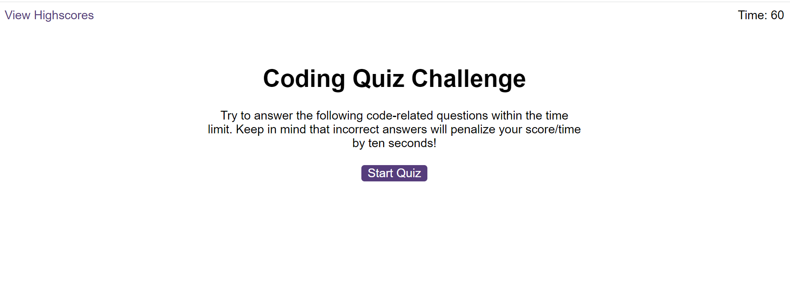

# Code-Quiz-Challenge

# Description

This repository holds the code for the Module 6 Code Quiz Challenge, which involved building a timed coding quiz with multiple choice questions.

The finished application is designed to run in the browser and features dynamically updated HTML and CSS.

Link to live site: https://dombrown95.github.io/Code-Quiz-Challenge/

Image of live site: 

# Usage

When the application is initially loaded, users will be prompted with a 'Start Quiz' button. Once this button has been clicked, multiple choice questions will appear on the screen, with the next question appearing once an answer has been selected. 

Each correct question gives the user one point towards their final score, while an incorrect answer will deduct 10 seconds from the 60 second time limit. 

Once the time limit hits 0 or the user has answered all questions, they will be taken to the end screen and prompted to enter their initials to record their score on the highscores table.

# Contributing 

Contributions can be made to the questions by editing them and their answers in the questions.js file provided. 

# Resources 

- 09-Ins-Timer-Intervals task to help with the timer code.

- How to make quiz questions appear - 
https://stackoverflow.com/questions/65797893/how-to-make-quiz-questions-appear-one-at-a-time-after-clicking-next-in-javascrip

- Correct format for quiz questions/correct answers - 
https://stackoverflow.com/questions/40569293/displaying-questions-for-a-quiz-using-javascript

- Score function for a quiz in JavaScript
https://stackoverflow.com/questions/66308020/how-to-add-a-score-function-to-my-quiz-using-javascript

- Opening separate files
https://stackoverflow.com/questions/41559837/how-can-i-use-the-same-js-file-with-other-html-files

- Saving scores on highscores page - 
https://stackoverflow.com/questions/60037063/how-to-save-scores-in-javascript-quiz

- Sorting scores - 
https://stackoverflow.com/questions/53797740/top-10-scores-using-javascript

- Local Storage set item method - 
https://developer.mozilla.org/en-US/docs/Web/API/Storage/setItem

